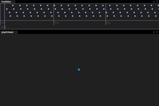

# GreyCat: samples
This project contains minimalist but easy to hack GreyCat samples.
These samples highlight the most important features implemented in Core, Core JS and the various plugins of GreyCat.
This small project gives hints about temporal graphs illustrated as follow:

## 0: pom.xml
This project define the classic way to import GreyCat in your code using maven.
Have a look to the pom.xml definition that give you an illustration of the various dependencies that you can use.

## 1: Minimal.java
The GreyCat hello world, covers node creation, attributes and relationships manipulation in a static graph example.

## 2: Temporal
Before everything, GreyCat is designed to handle temporal data.
This sample shows the various temporal graph usage.

## 3: Index
Indexes are entry-points of GreyCat to be declared by developers to enable fast access to specific nodes.
This sample highlights the various usage of indexing methods to index and find a node based on its attributes.

## 4: Server
Graph can be remotely accessed to design a client/server architecture.
This sample shows how to expose your graph as a WebSocket server.

## 5: Client
Graph can remotely pull data from a remote server.
Following this sample you will be able to connect a graph to its server.

## 6: Task

Avoiding the nested callback hell !
The Task API provides a nice API to chain actions and pipe asynchronous operations on top of GreyCat in order to avoid the nested callback hell.

## 7: Browser

TODO
